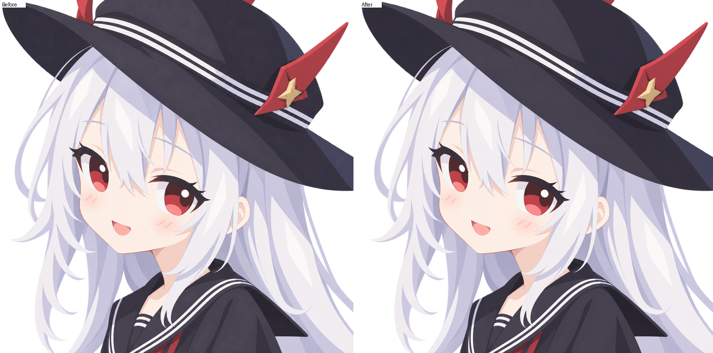
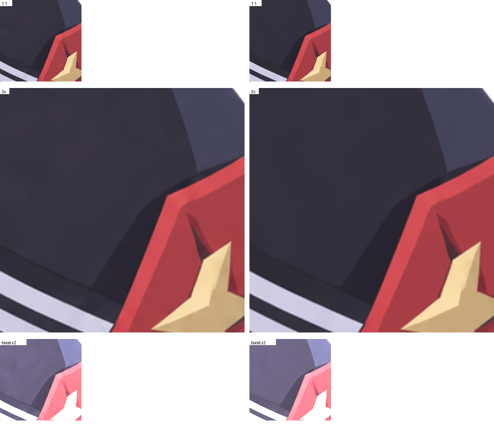
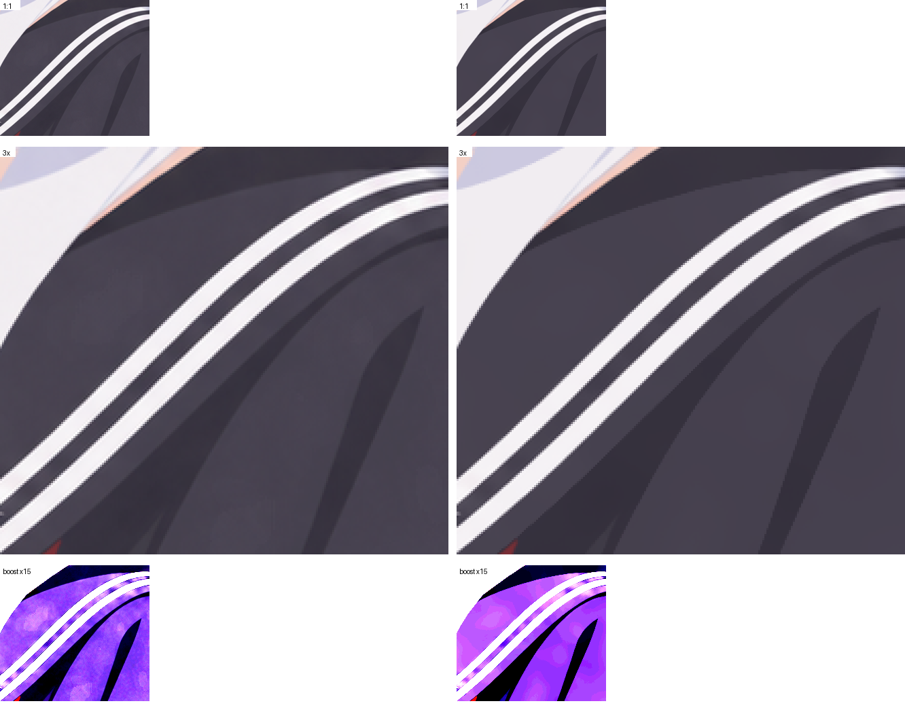
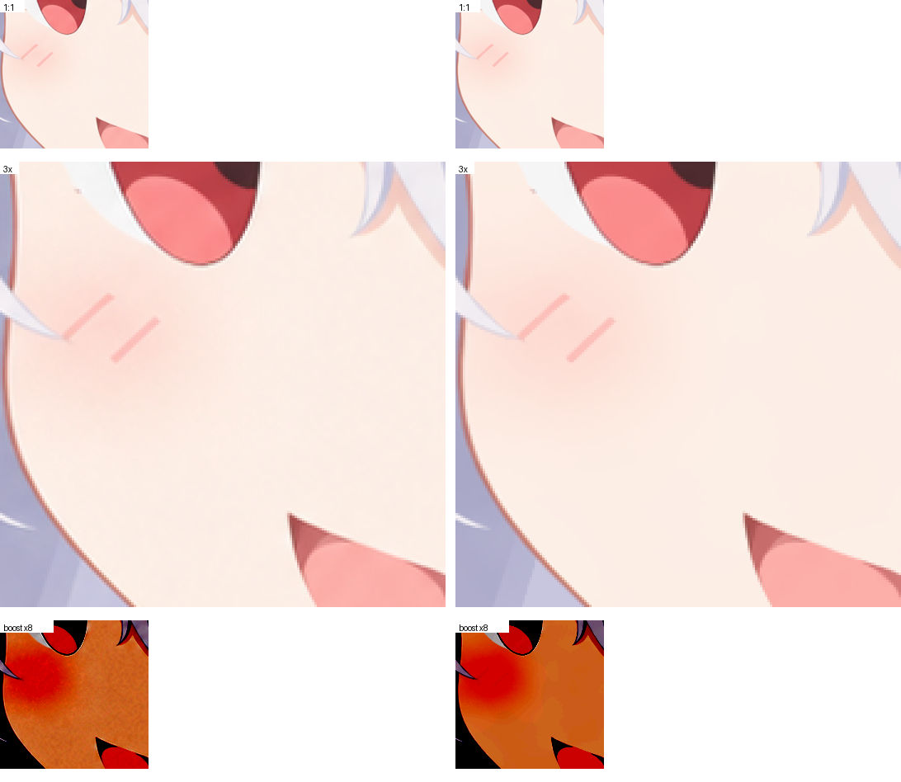
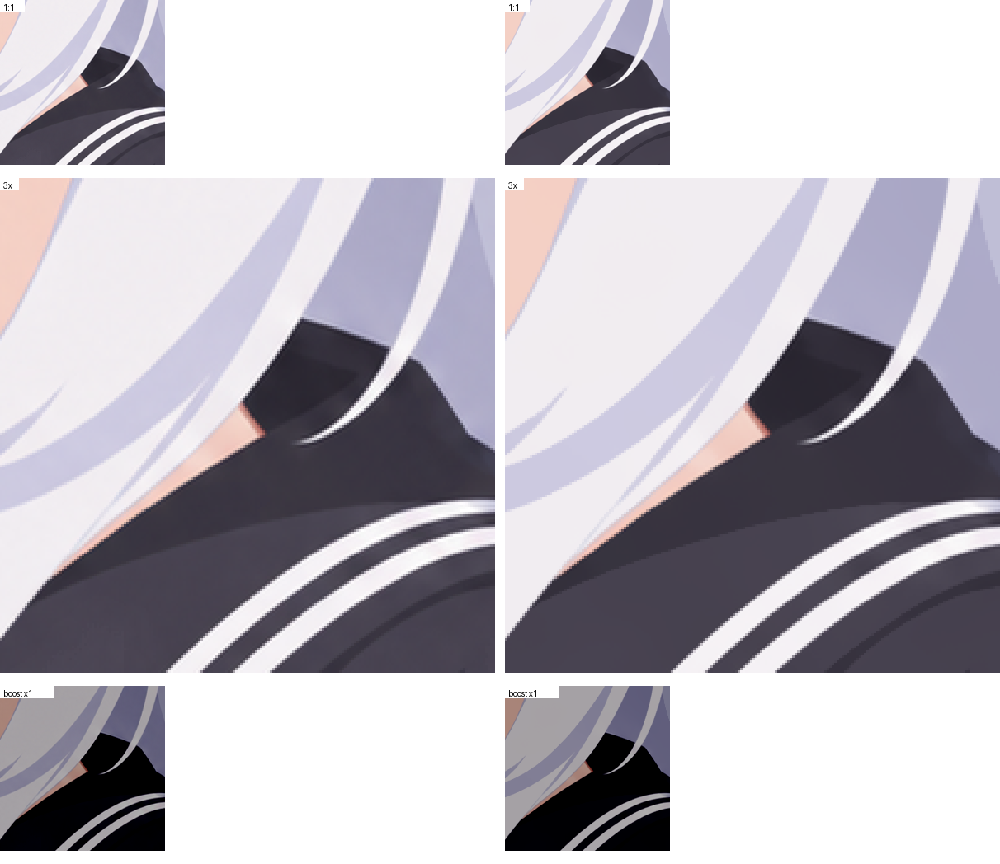

# celclean — 把 AI 出的赛璐璐图「洗干净」

AI 画图（GPT / 即梦 / Midjourney …）产出的赛璐璐（平涂）风格图，放大看总有一层**脏脏的云雾噪点**：
本来该是一块纯色的地方，布满了云状斑块和颗粒，怎么调都像被压缩过。对平涂风格来说这是硬伤。

celclean 专门治这个：

- 把**颗粒和云雾斑块**从纯色区抹掉，色块恢复成干净的一整块；
- **保住**腮红、头发阴影这类真实渐变，以及 1–2 像素的细线、线稿、边缘抗锯齿；
- 顺手收拾 alpha 通道（内部半透明 → 不透明、背景杂点清零、半透明边缘不被写黑）。

它**不做**放大、不改画风、不移动线条、不重画——只把「不干净的底色」变成「干净的底色」。
默认档改动的像素里，99% 的变化不超过 3.9 个色阶，最大的也只有 8 个色阶（8-bit 的 255 级里）。

---

## 一、效果对比

### 1. 整体对比（左：原图　右：清理后）



肉眼看差别很小——这正是期望的结果：**它改的是「该是纯色却脏」的地方，不动画面内容**。
想看它到底做了什么，请看下面的局部细节（也可以自己跑 `uv run celclean compare avator.png`）。

### 2. 局部细节

每个局部图有三行：

| 行 | 含义 |
|---|---|
| `1:1` | 原尺寸，看整体观感 |
| `3x` | 放大 3 倍（最近邻），看像素级纹理 |
| `boost` | 自动把对比度拉高若干倍，**专门用来暴露肉眼不易察觉的噪点** |

#### ① 帽子 / 头发（大面积纯色块）



看 `boost` 行：左边的深色块里能看到明显的云状脏斑，右边被清成干净的一块。

#### ② 黑水手服 + 白条纹（细线、边缘抗锯齿）



白条纹的宽度、位置、边缘的柔和过渡都保持不变——**细线不会被抹掉**。

#### ③ 脸颊 + 腮红（真实渐变 + 1–2 像素细笔画）



这张最关键：`boost` 行里左边的皮肤是一片斑驳的橙色云雾，右边变得平滑，而**腮红渐变依旧在**，
两道深红细笔画一根没少。

#### ④ 头发阴影（真实渐变）



发丝的阴影层次被保留，只是不再有噪点颗粒。

---

## 二、安装

需要 [uv](https://docs.astral.sh/uv/)（一个 Python 包管理器，装一次就行）。除了 numpy 和 Pillow 没有别的依赖，
不需要 GPU，不下载任何模型。

```bash
# 在本目录下执行
uv sync
```

## 三、使用

```bash
# 最常用：生成 xxx-clean.png（与原图同目录）
uv run celclean clean 你的图.png

# 指定输出文件名
uv run celclean clean 你的图.png -o 干净版.png

# 顺便输出测量报告（JSON，含前后对比的数字）
uv run celclean clean 你的图.png --report

# 生成前后对比图（整体一张 + 自动挑两个局部细节）
uv run celclean compare 你的图.png --out-dir 对比图

# 想自己指定要看哪几个局部：x,y,宽,高，可重复
uv run celclean compare 你的图.png --crop 860,150,200,200 --crop 280,640,180,180

# 拿仓库里的样图试一遍
uv run celclean clean avator.png && uv run celclean compare avator.png
```

批量处理（Windows 命令行）：

```bat
for %f in (*.png) do uv run celclean clean "%f"
```

输入可以是任何 Pillow 能读的格式（PNG / JPG / WebP…），输出统一是 PNG（RGBA，保留透明）。

## 四、参数与推荐档位

**大多数时候你不需要任何参数。** 下面是"想更干净 / 想更快"时的四个档位（同一张 1254×1254 图实测）：

| 档位 | 命令 | 效果（平坦区起伏 / 3×3 纯色像素占比 / 最坏改动） | 耗时 |
|---|---|---|---|
| 快 | `--stride 2` | 0.081 / 0.46 / 7 色阶 | 0.9 s |
| **默认（推荐）** | `clean x.png` | **0.055 / 0.55 / 8 色阶** | 3.0 s |
| 更干净 | `--radius 20` | 0.054 / 0.57 / 9 色阶 | 4.9 s |
| 最纯（有代价，见下） | `--snap` | 0.043 / **0.64** / 19 色阶 | 15 s |

> "平坦区起伏"= 本来平坦的像素上的局部波动，越小越干净（原图 0.267）；"3×3 纯色像素占比"= 3×3 邻域
> 完全同色的像素比例，越大越像"数学纯色块"（原图 0.18）；"最坏改动"= 单像素的最大改动色阶数。

其余参数：

| 参数 | 默认 | 什么时候用 |
|---|---|---|
| `--strength 0.5~2` | `1.0` | 只想轻度处理时调**小**（如厚涂图/照片 `0.4~0.6`）。注意：**调大不会更干净**，只会让最坏改动变得很大 |
| `--radius` | 自动 | 想更干净可试 `20`；**噪声很轻的图**反而该调小（`8~12`），否则会过度平滑 |
| `--alpha keep` | `normalize` | 不想让内部半透明 alpha 被统一成不透明时用（默认会统一，这对修 AI 出图的脏 alpha 是必要的） |
| `--snap` / `--no-snap` | `--no-snap` | 想要"绝对纯色块"时开。它比默认更纯（3×3 纯色 0.55 → 0.64），但**大片的柔和渐变上会出现硬边色斑**（我们放大对比过，肉眼可见），所以默认不开 |
| `--snap-mode plane\|constant` | `plane` | 开 `--snap` 时的模型。`constant` 会把一条缓坡整条刷成一个颜色（实测残差 11 色阶 vs 2 色阶），**不建议**，留着只是为了对照 |
| `--sigma` | 自动 | 覆盖自动测出的噪声强度（Lab L 单位），基本用不到 |

## 五、它比同类工具强在哪

我们把 41 个同类开源项目/思路都过了一遍，把其中 19 种（34 个参数档，含通用去噪、AI 动漫超分、矢量化、
调色板量化）在同一张图上实测对比（两个纯净度指标都是"越低/越高越纯"，与我们的默认档同口径）：

| 做法 | 平坦窗口 std ↓ | 3×3 纯色占比 ↑ | 真实渐变 | 1–2px 细线 | 最坏改动 | alpha |
|---|---|---|---|---|---|---|
| **celclean 默认** | 0.220 | **0.55** | 保留 | 保留 | **8 色阶，无 >8 色阶像素** | 完整处理 |
| celclean `--snap` | **0.184** | **0.64** | 保留但有色斑 | 保留 | 19 色阶 | 同上 |
| vtracer（矢量化重画） | **0.000** | **0.81–0.97** | **压成色带** | **约 90% 被抹掉** | 190–200 色阶 | 重写 130 万像素 |
| waifu2x（AI 动漫去噪） | 0.359 | 0.02 | 最忠实 | 保留 | 66 色阶 | 不变 |
| cv2 双边 d=21 | 0.243 | 0.46 | 保留 | 尚可 | 10.5 色阶 | 无 |
| cv2 NL-means h=3 | 0.190 | 0.58 | 保留 | 保留 | 33.2 色阶 | 无 |
| 深度学习去噪（DnCNN / FFDNet） | 0.17–0.38 | 未量 | 保留 | 保留 | 1000+ 个像素改动 >8 色阶 | 无 |
| 调色板量化（pngquant / PIL） | 0.29–0.38 | 0.15–0.17 | **压成色带** | 会产生假边 | 40–117 色阶 | 部分 |

（原图作为参照：窗口 std 0.389、3×3 纯色占比 0.18 —— 也就是说纯色区里几乎没有 3×3 完全同色的像素，这就是要治的病。）

三条结论：

1. **"把色块变成绝对纯色"只有矢量化能彻底做到，但它是"重画"**：整张图平均改动 2.7–19.4 色阶、腮红渐变
   被压成 94 级色带、约 90% 的细线像素消失、透明背景被重新描摹成实体形状。我们要的是清洗，不是重画。
2. **通用去噪器没有"安全中间档"**：按真实噪声强度调，它们几乎什么都不做（深度学习去噪的色块 std 0.389→0.381）；
   调到能去掉云雾，就开始重画像素（NL-means h=6 有 2.1 万个像素改动 >8 色阶，引导滤波改动 42% 的像素）。
   celclean 是少数**真的洗了、同时把最坏改动压在 8 色阶以内**的做法。
3. **没有一个同类工具处理 alpha 语义**（半透明边缘、游离杂点、透明区垃圾 RGB），这件事我们做了。

更完整的对比数据（每个工具的每个参数档、分区域数字、裁图）见 **[技术方案 TECHNICAL.md](TECHNICAL.md)**。

## 六、常见问题

**会不会把画风改掉？**
不会。默认档与原始画面的亮度相关性 0.9999，逐像素平均只动 0.63 个色阶。它不做放大、不补画、不上色。

**为什么深色的地方感觉洗得比较狠？**
它按**人眼感受**（CIELab 色差）判断"颜色相近"，而暗部 1 个色阶 ≈ 0.3 色差单位、亮部 1 个色阶 ≈ 1 色差单位。
所以"同样肉眼可见的变化"在明暗处被同等对待。想更保守就 `--strength 0.6`。

**放大看渐变里有淡淡的横条（色带）？**
这是 8-bit 量化的固有现象，而且**去噪会把它显出来**：原图的颗粒噪声恰好充当了抖动，颗粒被去掉后，
渐变就还原成 1 色阶的台阶（这张图的腮红区，≥12px 的平台面积从 4.5% 涨到 56%）。这是"纯净"与"无台阶"
在 8-bit 输出下的取舍，我们选了纯净。缓解办法：`--radius 8` 更柔和。

**合成到深色背景后感觉变亮了一点点？**
原图的内部 alpha 是 250–254（不是 255），默认会统一成 255，合成到黑底上最多亮 5 个色阶（约 2% 的像素）。
在意的话用 `--alpha keep`。

**边缘上偶尔还有一两个高对比的小白点/黑点？**
这些点和"真实高光/细节"在数学上无法区分，工具选择保留（宁可留着，也不冒险擦掉真东西）。
实测这类"可疑点"里 91% 是贴在线稿/发丝交界处的**正常渲染像素**，强行清除会误伤真高光，所以默认不动。

**支持透明背景吗？** 支持，而且专门处理过：半透明边缘的 RGB 会保留（否则合成到白底上会变成灰点），
完全透明的像素 RGB 清零，孤立的近零 alpha 杂点归零。

## 七、限制

- 它是给**平涂/赛璐璐**风格用的。厚涂、水彩、真实照片会被当成"大块噪声"抹掉细节，请用 `--strength 0.4~0.6`，或者别用。
- 不做放大、不补画、不上色——只做"底色变干净"。
- **8-bit 输出下"绝对纯色块"与"看不到色带"在亚色阶区域数学上互斥**：真色值落在两个色阶之间时，要么抖成
  两色（有颗粒、无台阶），要么取整成一个色（纯净、有台阶）。本工具默认选纯净。
- 所有参数的默认值都是在一张 1254×1254 的 AI 平涂图上标定的；换风格/换尺寸建议先用 `compare` 看一眼。

## 八、想深入了解

- **[技术方案 TECHNICAL.md](TECHNICAL.md)** — 算法原理、参数语义、验收口径与全部实测数据、性能优化与逐位等价证明、
  与同类工具的逐项对比、已知失效模式、复现命令。
- 同一份文档的**第 11 节**还记录了设计演进：早期被实测否掉的方案、外部独立审核发现的缺陷、
  以及 v1→v2→v3 各版本的变更与依据。
- 跑测试：`uv run pytest -q tests`
